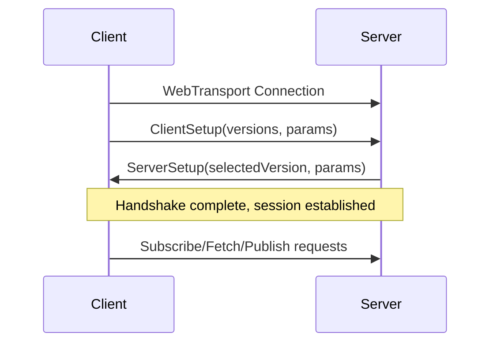

# ClientSetup

The `ClientSetup` message is sent by the client during the MOQT handshake to negotiate protocol version and capabilities with the server.

## Overview

ClientSetup is the first control message sent over the bidirectional control stream after establishing a WebTransport connection. It contains:

1. A list of supported protocol versions (in preference order)
2. Optional setup parameters for capability negotiation

The server responds with a `ServerSetup` message selecting one of the offered versions and providing its own parameters.

## ClientSetup Class

### Constructor

```typescript
const clientSetup = new ClientSetup(
  supportedVersions: number[],
  setupParameters: KeyValuePair[]
)
```

<ParamField path="supportedVersions" type="number[]" required>
  Ordered list of MOQT protocol version numbers the client supports. The server will select one from this list.
  
  **Common versions:**
  - `0xff00000e` (4278190094) - MOQT Draft-14 (current)
  - `0xff00000b` (4278190091) - MOQT Draft-11
</ParamField>

<ParamField path="setupParameters" type="KeyValuePair[]" required>
  Array of key-value pairs containing setup parameters. Use `SetupParameters` builder for convenience.
</ParamField>

### Methods

#### `serialize()`

Serializes the ClientSetup message to a wire format.

```typescript
serialize(): FrozenByteBuffer
```

<ResponseField name="return" type="FrozenByteBuffer">
  Serialized message ready for transmission
</ResponseField>

**Throws:**
- `LengthExceedsMaxError` - If payload length exceeds 65535 bytes

#### `parsePayload()`

Parses a ClientSetup message from a buffer.

```typescript
static parsePayload(buf: BaseByteBuffer): ClientSetup
```

<ParamField path="buf" type="BaseByteBuffer" required>
  Buffer containing the serialized ClientSetup payload
</ParamField>

<ResponseField name="return" type="ClientSetup">
  Parsed ClientSetup instance
</ResponseField>

---

## SetupParameters Builder

The `SetupParameters` class provides a fluent API for building setup parameter lists.

### Constructor

```typescript
const params = new SetupParameters()
```

Creates an empty SetupParameters builder.

### Methods

#### `addMaxRequestId()`

Sets the maximum request ID the client will use.

```typescript
addMaxRequestId(maxRequestId: bigint | number): SetupParameters
```

<ParamField path="maxRequestId" type="bigint | number" required>
  Maximum request ID value (must be >= 0)
</ParamField>

<ResponseField name="return" type="SetupParameters">
  The builder instance for chaining
</ResponseField>

**Parameter Key:** `0x00`

#### `addMaxAuthTokenCacheSize()`

Sets the maximum number of authorization tokens to cache.

```typescript
addMaxAuthTokenCacheSize(size: bigint | number): SetupParameters
```

<ParamField path="size" type="bigint | number" required>
  Maximum cache size (must be >= 0)
</ParamField>

<ResponseField name="return" type="SetupParameters">
  The builder instance for chaining
</ResponseField>

**Parameter Key:** `0x01`

#### `addRole()`

Sets the client's role in the MOQT session.

```typescript
addRole(role: Role): SetupParameters
```

<ParamField path="role" type="Role" required>
  Client role:
  - `Role.Publisher` (0x01) - Can publish tracks
  - `Role.Subscriber` (0x02) - Can subscribe to tracks
  - `Role.PubSub` (0x03) - Can both publish and subscribe
</ParamField>

<ResponseField name="return" type="SetupParameters">
  The builder instance for chaining
</ResponseField>

**Parameter Key:** `0x00` (in version-specific parameters)

#### `build()`

Builds the final parameter array.

```typescript
build(): KeyValuePair[]
```

<ResponseField name="return" type="KeyValuePair[]">
  Array of key-value pairs ready for use in ClientSetup
</ResponseField>

---

## Usage Examples

<CodeGroup>
```typescript Basic Setup
const params = new SetupParameters().build();
const clientSetup = new ClientSetup(
  [0xff00000e], // Draft-14
  params
);
```

```typescript With Parameters
const params = new SetupParameters()
  .addMaxRequestId(1000)
  .addMaxAuthTokenCacheSize(50)
  .addRole(Role.PubSub)
  .build();

const clientSetup = new ClientSetup(
  [0xff00000e, 0xff00000b], // Draft-14, then Draft-11 as fallback
  params
);
```

```typescript Multiple Versions
// Client supports multiple protocol versions
const clientSetup = new ClientSetup(
  [
    0xff00000e, // Draft-14 (preferred)
    0xff00000b, // Draft-11 (fallback)
  ],
  new SetupParameters().build()
);
```

```typescript Using with MOQtailClient.new()
import { MOQtailClient, SetupParameters } from 'moqtail';

const client = await MOQtailClient.new({
  url: 'https://relay.example.com/moq',
  supportedVersions: [0xff00000e],
  setupParameters: new SetupParameters()
    .addMaxRequestId(10000)
    .addRole(Role.PubSub)
});
```
</CodeGroup>

---

## ServerSetup Response

After sending ClientSetup, the client receives a `ServerSetup` message containing:

```typescript
interface ServerSetup {
  selectedVersion: number;        // Version chosen from client's list
  setupParameters: KeyValuePair[]; // Server's parameters
}
```

Access the negotiated setup via:

```typescript
const client = await MOQtailClient.new({ /* ... */ });
const serverSetup = client.serverSetup;

console.log('Negotiated version:', serverSetup.selectedVersion.toString(16));
console.log('Server parameters:', serverSetup.setupParameters);
```

---

## Setup Parameter Keys

### Common Setup Parameters

| Key | Name | Type | Description |
|-----|------|------|-------------|
| `0x00` | MAX_REQUEST_ID | VarInt | Maximum request ID client will use |
| `0x01` | MAX_AUTH_TOKEN_CACHE_SIZE | VarInt | Maximum authorization tokens to cache |

### Version-Specific Parameters

These parameters are nested within setup parameters:

| Key | Name | Type | Description |
|-----|------|------|-------------|
| `0x00` | ROLE | VarInt | Client role (Publisher=1, Subscriber=2, PubSub=3) |

---

## Protocol Flow



---

## Best Practices

<Tip>
**Version Negotiation**: List versions in order of preference. The server will select the first version it supports from your list.
</Tip>

<Warning>
**Max Request ID**: Setting a low `maxRequestId` can limit the number of concurrent operations. Choose a value appropriate for your use case (default: unlimited).
</Warning>

<Info>
**Role Parameter**: Setting the role parameter helps relays optimize resource allocation. Use `Role.Publisher` if you only publish, `Role.Subscriber` if you only subscribe, or `Role.PubSub` if you do both.
</Info>

---

## See Also

- [MOQtailClient](/api/moqtail-client) - Main client class
- [VersionSpecificParameters](/api/version-specific-parameters) - Request-level parameters
- [MOQT Protocol Draft-14](https://datatracker.ietf.org/doc/html/draft-ietf-moq-transport-14) - Official specification
