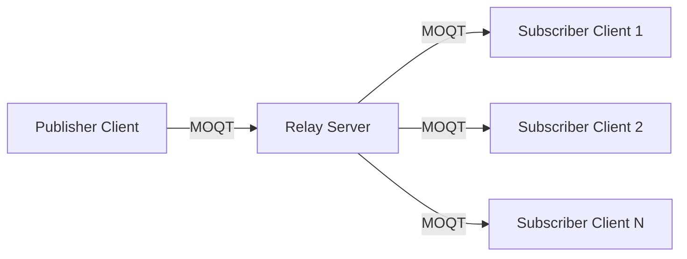

## What is Moqtail?

Moqtail is a Draft 14-compliant TypeScript client library for **Media over QUIC Transport (MOQT)** protocol, designed for seamless integration with WebTransport and MoQ relay servers. It enables efficient streaming of live and on-demand media content over modern QUIC connections.

<Note>
Moqtail is under active development and the API is subject to change. Please use with caution in production environments.
</Note>

## Key Features

<CardGroup cols={2}>
  <Card title="Type-Safe Development" icon="shield-check">
    Built with TypeScript for complete type safety and excellent IDE support
  </Card>
  
  <Card title="WebTransport Support" icon="bolt">
    Leverages next-generation WebTransport protocol for high-performance media delivery
  </Card>
  
  <Card title="Dual-Mode Operation" icon="arrows-split-up-and-left">
    Act as both publisher (content creator) and subscriber (content consumer)
  </Card>
  
  <Card title="Flexible Content Delivery" icon="stream">
    Support for live streaming, on-demand content, and hybrid modes
  </Card>
</CardGroup>

## What is MOQT?

MOQT (Media over QUIC Transport) is a protocol for media delivery over QUIC connections, enabling efficient streaming of live and on-demand content. The protocol supports:

- **Low-latency streaming**: Real-time media delivery with minimal buffering
- **Reliable transport**: Built on QUIC's reliable stream and datagram mechanisms
- **Scalable distribution**: Efficient relay-based architecture for content distribution
- **Flexible delivery modes**: Support for both push (subscribe) and pull (fetch) patterns

## Architecture Overview

Moqtail operates in a client-relay architecture:



### Client Roles

<Steps>
  <Step title="Publisher (Original Publisher)">
    Creates and announces tracks, making content available to subscribers. Publishers package media data as `MoqtObject` instances and serve them through live streams or cached content.
  </Step>
  
  <Step title="Subscriber (End Subscriber)">
    Discovers and consumes content from publishers via track subscriptions. Subscribers can request live streaming content or fetch historical data on-demand.
  </Step>
</Steps>

## Core Concepts

### Tracks

A **track** is a logical stream of media or data identified by:
- **Namespace**: Hierarchical path segments (e.g., `["live", "conference"]`)
- **Track Name**: Unique identifier within the namespace (e.g., `"video"`)

### Objects

Content is packaged as **MoqtObject** instances, which represent atomic units of data:
- **Location**: Identified by `groupId` and `objectId` (e.g., video frames within GOPs)
- **Payload**: The actual media data or content
- **Metadata**: Publisher priority, forwarding preferences, and extension headers
- **Status**: Normal data, end-of-group markers, or error conditions

### Content Sources

Moqtail provides three content delivery patterns:

<CodeGroup>
```typescript Live Content
import { LiveContentSource } from 'moqtail/client'

// For real-time streaming (e.g., live video)
const liveSource = new LiveContentSource(objectStream)
```

```typescript Static Content
import { StaticContentSource, MemoryObjectCache } from 'moqtail/client'

// For on-demand content (e.g., video-on-demand)
const cache = new MemoryObjectCache()
const staticSource = new StaticContentSource(cache)
```

```typescript Hybrid Content
import { HybridContentSource } from 'moqtail/client'

// Combines live streaming with historical data access
const hybridSource = new HybridContentSource(objectStream, cache)
```
</CodeGroup>

## Use Cases

Moqtail is ideal for:

- **Live video conferencing**: Low-latency real-time communication
- **Live streaming**: Broadcasting events with minimal delay
- **Video on demand**: Efficient delivery of archived content
- **Gaming**: Real-time game state synchronization
- **IoT data streams**: Sensor data distribution with guaranteed delivery
- **File transfers**: Reliable large file distribution

## Protocol Compliance

Moqtail implements **MOQT Draft 14** specification, ensuring compatibility with:
- Standard MOQT relay servers
- Other Draft 14-compliant clients
- WebTransport-enabled browsers (Chrome, Edge, etc.)

## System Requirements

<Card title="Browser Compatibility" icon="browser">
  WebTransport support is required. Currently supported in:
  - Chrome 97+
  - Edge 97+
  - Opera 83+
</Card>

<Warning>
  Safari and Firefox do not yet support WebTransport. Check [caniuse.com/webtransport](https://caniuse.com/webtransport) for the latest browser compatibility.
</Warning>

## Next Steps

<CardGroup cols={2}>
  <Card title="Installation" icon="download" href="/installation">
    Install Moqtail in your project
  </Card>
  
  <Card title="Quick Start" icon="rocket" href="/quickstart">
    Build your first MOQT application
  </Card>
</CardGroup>
